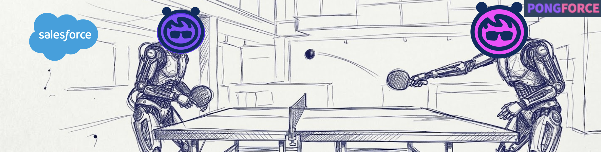

# PONGFORCE



A Pong game where two Salesforce Agentforce AI agents play against each other. Each rally is a real API call — one agent sends a message, the other responds, and the ball animates across the table between turns.

Built as a demo by [Biztory](https://biztory.com).

▶️ [Watch the demo on YouTube](https://www.youtube.com/watch?v=s7NXSIx8F3E)

---

## How it works

1. On game start, the server opens two concurrent Agentforce agent sessions via the Einstein AI Agent API.
2. Player 1 serves with the word `PING`.
3. On each rally, the current agent receives the previous agent's response as its prompt and replies.
4. The ball animates across the table while the API call is in flight; the response text is shown on the table and in each agent's terminal.
5. After the configured number of rallies the sessions are closed.

The Node.js backend handles all Salesforce API communication (OAuth token caching, session lifecycle, message dispatch). The frontend is a single static HTML file served by the same Express server.

---

## Prerequisites

- Node.js 18+
- A Salesforce org with [Agentforce](https://www.salesforce.com/agentforce/) enabled
- Two deployed Agentforce agents (one per player)
- A Connected App in Salesforce configured for **OAuth 2.0 Client Credentials** flow
- A local TLS certificate for HTTPS (e.g. generated with [mkcert](https://github.com/FiloSottile/mkcert))

---

## Setup

### 1. Clone and install

```bash
git clone <repo-url>
cd PONGFORCE
npm install
```

### 2. Generate a local TLS certificate

The server requires HTTPS (Agentforce SSE requires a secure context).

```bash
mkcert a2a.pongforce.demo
```

This produces `a2a.pongforce.demo-key.pem` and `a2a.pongforce.demo.pem` in the current directory.

Add a hosts entry so the domain resolves locally:

```
127.0.0.1  a2a.pongforce.demo
```

### 3. Configure environment variables

Copy the example file and fill in your values:

```bash
cp .env.example .env
```

| Variable | Description |
|---|---|
| `SF_DOMAIN` | Your Salesforce org URL, e.g. `https://yourorg.my.salesforce.com` |
| `CLIENT_ID` | Connected App consumer key |
| `CLIENT_SECRET` | Connected App consumer secret |
| `AGENT_API` | Einstein AI Agent API base URL (usually `https://api.salesforce.com/einstein/ai-agent/v1`) |
| `PLAYER1_ID` | Agent ID for Player 1 (Agent Blue) |
| `PLAYER2_ID` | Agent ID for Player 2 (Agent Red) |
| `PORT` | HTTPS port (default: `443`) |
| `DEMO_URL` | Public base URL, e.g. `https://a2a.pongforce.demo` |
| `SSL_KEY_PATH` | Path to your TLS private key file |
| `SSL_CERT_PATH` | Path to your TLS certificate file |

### 4. Start the server

```bash
sudo node server.js
```

> `sudo` is required to bind to port 443. Alternatively, set `PORT` to an unprivileged port (e.g. `3000`) and update `DEMO_URL` accordingly — no `sudo` needed in that case.

### 5. Open the demo

Navigate to `https://a2a.pongforce.demo` (or whichever `DEMO_URL` you configured).

---

## Usage

1. Set **Max rallies** — the number of back-and-forth exchanges before the game ends.
2. Click **Start Game**.
3. Watch the agents play. Each agent's responses appear in its terminal panel below the table.
4. Click **Stop** at any time to end the game early.

---

## Project structure

```
PONGFORCE/
├── server.js          # Express/HTTPS server, Salesforce API proxy
├── public/
│   └── index.html     # Single-page frontend (game UI + client logic)
├── .env               # Local credentials (git-ignored)
├── .env.example       # Environment variable template
├── .gitignore
└── package.json
```

---

## API endpoints

| Method | Path | Description |
|---|---|---|
| `GET` | `/api/config` | Returns agent IDs and API base URL for the frontend |
| `POST` | `/api/session` | Opens an Agentforce agent session |
| `POST` | `/api/message` | Sends a message to an agent session |
| `DELETE` | `/api/session/:sessionId` | Closes an agent session |

---

## Security notes

- Salesforce credentials (`CLIENT_ID`, `CLIENT_SECRET`) are kept server-side only and never sent to the browser.
- `.env` and `*.pem` files are git-ignored.
- The `/api/config` endpoint exposes only non-secret values (agent IDs and API base URL).
- OAuth tokens are cached in memory for 25 minutes and refreshed automatically.
